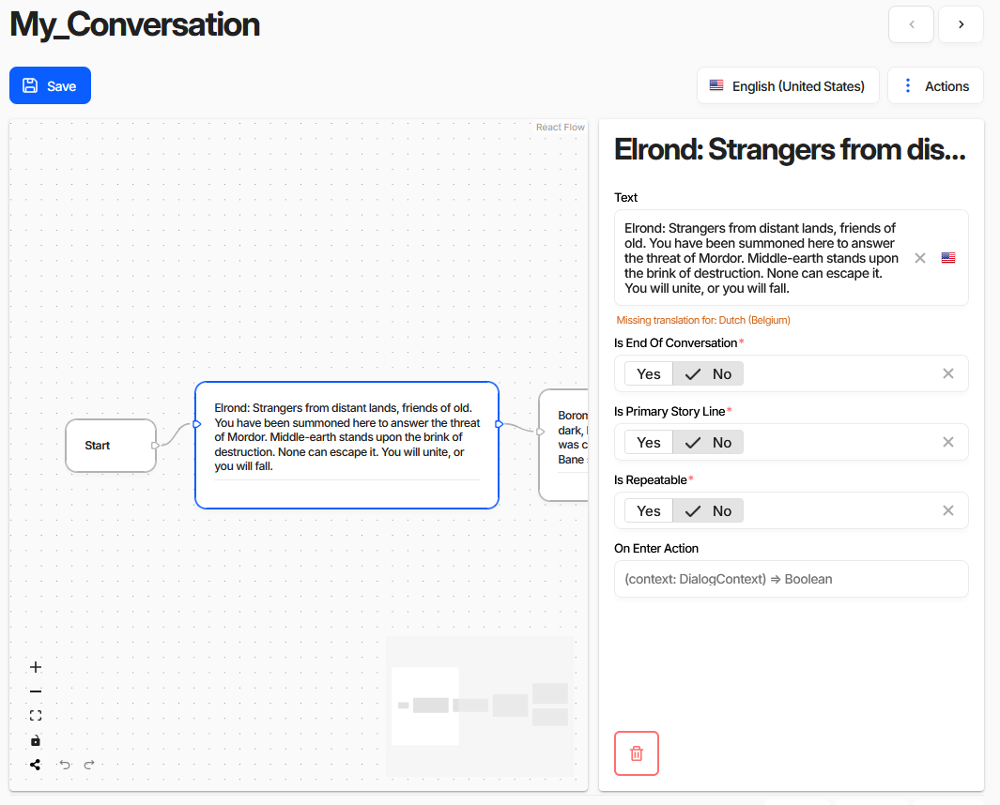

# Charon Conversation Editor Extension

A visual node-based conversation/dialog editor for [Charon](https://gamedevware.com/), built with React and [React Flow](https://reactflow.dev/).



## Quick Start

```bash
npm install
npm start       # Vite dev server with mock data
npm run build   # Produces dist/*.tgz for publishing
```

## Try It in Charon

Install the published package or upload a local build:

1. Go to **Project Settings > Extensions**, add `charon-conversation-editor`, click **Update**.
2. Create the conversation schemas using one of:
   - **Custom action** (recommended): On the project dashboard, click **Add New Schema** and select **Create Conversation Schema** from the menu.
   - **Manual import**: Click **Import Documents**, choose **Create and Update > Clipboard**, paste contents of [conversation_schemas_to_import.json](conversation_schemas_to_import.json), select **All** collections, and import.
   - **Migrate existing schema**: Create a schema, set its editor to **Conversation Editor** in advanced options, create a document, switch to **Graph** view, and click **Migrate**.
3. After the page reloads the editor is ready. If migration reports schema errors, fix them manually — **do not click Migrate again**.

## Architecture

```
Charon host application
  -> <ext-conversation-editor>   (Web Component, registered in main.tsx)
    -> React app                 (ConversationEditor, mounted inside shadow-less custom element)
      -> React Flow              (node graph rendering, layout via dagre)
        -> DocumentControl       (two-way sync with Charon's data model)
```

The extension registers a custom element that implements `CharonSchemaEditorElement`. Charon sets `documentControl` on the element, which is a `RootDocumentControl` providing access to the document's value tree, validation, undo/redo, and services. The React layer subscribes to control value changes and writes back through `setValue`/`patchValue`.

### Extension Registration (package.json)

```jsonc
{
  "config": {
    "customEditors": [{
      "id": "ext-conversation-editor",
      "selector": "ext-conversation-editor",  // custom element tag name
      "name": "Conversation Editor",
      "type": ["Schema"]                       // full-document editor
    }],
    "customActions": [{
      "name": "Create Conversation Schema",
      "functionName": "createConversationSchema",  // exported from main entry or declared on globalThis (window)
      "location": "new-schema-menu",
      "icon": "emoji/speech_balloon"
    }]
  }
}
```

## Project Structure

```
src/
  main.tsx                          # Entry point: registers custom element + exports custom action
  conversation.editor.element.tsx   # Web Component bridge (CharonSchemaEditorElement -> React)
  conversation.editor.tsx           # Root React component (React Flow setup, toolbar)
  error.boundary.tsx                # Error boundary wrapper

  models/                           # TypeScript types for the conversation data model
    conversation.tree.ts            #   Top-level conversation tree structure
    dialog.node.ts                  #   Dialog node (NPC line, narration)
    dialog.response.ts              #   Player response/choice
    dialog.node.reference.ts        #   Reference linking nodes

  nodes/                            # React Flow node components and hooks
    dialog.tree.node.tsx            #   Dialog node renderer
    dialog.tree.response.tsx        #   Response choice renderer
    root.node.tsx                   #   Conversation root (start marker)
    node.types.ts                   #   Node type registry for React Flow
    document.control.functions.ts   #   Helpers for reading/writing DocumentControl values
    use.control.to.flow.sync.ts     #   Hook: syncs DocumentControl <-> React Flow nodes/edges
    use.control.copy.paste.monitor.ts
    use.control.focus.target.ts
    use.delete.control.handler.ts
    use.selected.control.monitor.ts

  state/                            # App-level state and context
    conversation.state.ts           #   Converts between Charon data format and React Flow format
    conversation.context.ts         #   React context for sharing conversation state
    undo.redo.state.ts              #   Undo/redo state tracking
    undo.redo.context.ts            #   React context for undo/redo
    use.undo.redo.function.ts       #   Hook: wires into Charon's UndoRedoService
    use.localized.text.ts           #   Hook: resolves localized text for current language

  controls/                         # Toolbar button components
    undo.button.tsx
    redo.button.tsx
    auto.layout.button.tsx

  property.drawer/                  # Side panel for editing selected node properties
    property.drawer.tsx             #   Drawer container with resize
    property.drawer.content.tsx     #   Property fields rendered via Charon's built-in elements

  schema.validation/                # Schema migration and validation
    validate.schema.ts              #   Checks schema has required properties
    migrate.schema.ts               #   Migrates/creates conversation schemas via GameDataService
    conversation.schema.ts          #   Expected schema shape definition
    schema.validation.result.tsx    #   UI for displaying validation errors

  reactive/                         # React hooks for charon-extensions reactive types
    use.observable.function.ts      #   Hook: subscribes to ObservableLike<T>
    use.control.value.function.ts   #   Hook: tracks ValueControl.value
    use.control.disabled.status.function.ts
    use.control.read.only.status.function.ts
    use.debounce.function.ts

  dev/                              # Development mocks (only used by Vite dev server)
    create.dev.value.control.ts     #   Creates mock ValueControl/DocumentControl tree
    dev.value.control.ts            #   Mock ValueControl implementation
    dev.document.control.ts         #   Mock DocumentControl implementation
    dev.root.document.control.ts    #   Mock RootDocumentControl with stub services
    dev.metadata.ts                 #   Mock Metadata/Schema/SchemaProperty
    initial.conversation.ts         #   Sample conversation data for development
    persist.to.local.storage.function.ts  # Persists dev state to localStorage
```

## Key Integration Points

### Data Flow: Charon <-> React Flow

`useControlToFlowSync` is the central hook. It:
1. Reads the `RootDocumentControl` value (a conversation tree with dialog nodes)
2. Converts it into React Flow `Node[]` and `Edge[]` via `conversationState.ts`
3. On user edits (drag, connect, delete), writes changes back via `DocumentControl.setValue`/`patchValue`

### Property Drawer

When a node is selected, `PropertyDrawer` renders Charon's built-in field elements (`<charon-text-field>`, `<charon-localized-text-field>`, etc.) by passing the node's child `ValueControl` to each element. This reuses Charon's native field editing, validation, and localization support.

### Schema Validation & Migration

On mount, `validateSchema` checks the document's schema has the expected properties (node text, responses, references). If properties are missing, `SchemaValidationResult` displays errors with an option to auto-migrate via `migrateSchema`, which uses `GameDataService.bulkChange` to create/update the required schemas.

### Custom Action: Create Conversation Schema

Exported from `main.tsx` as `createConversationSchema`. Receives an `ExtensionActionContext` and uses `GameDataService` to create the conversation schemas programmatically — an alternative to the JSON import flow.

### Undo/Redo

The editor wires into Charon's `UndoRedoService` via `useUndoRedo`. Node moves, connections, and property edits are pushed as undoable actions with batch grouping (e.g., sequential typing is combined into one undo step).

## Development

`npm start` launches Vite with mock implementations from `src/dev/`. These simulate the `RootDocumentControl`, `DocumentControl`, `Metadata`, and services so the editor runs standalone without Charon. Mock state is persisted to `localStorage`.

To test inside Charon:
1. `npm run build`
2. In Charon **Project Settings > Extensions**, click **Upload NPM Package** and select the `.tgz` from `dist/`

## Resources

- [Creating a Custom Editor with React](https://gamedevware.github.io/charon/advanced/extensions/creating_react_extension.html)
- [Charon Extensions Overview](https://gamedevware.github.io/charon/advanced/extensions/overview.html)
- [React Flow Documentation](https://reactflow.dev/)
- [Charon Repository](https://github.com/gamedevware/charon)

## License

MIT
